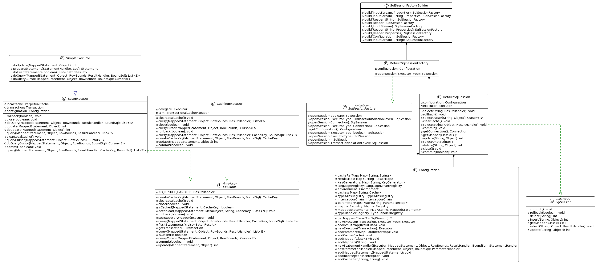
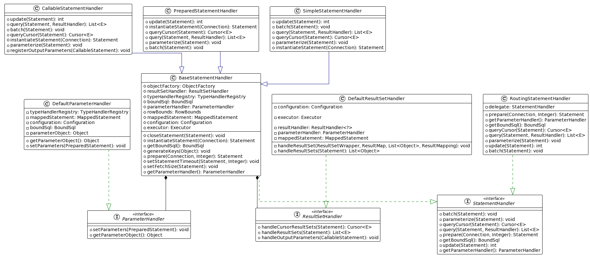
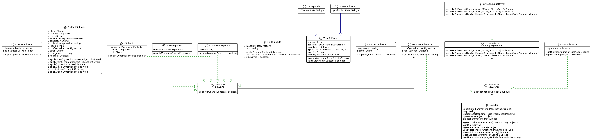

# 介绍

[Mybatis官网文档](https://mybatis.org/mybatis-3/zh/index.html)

[我的源码地址](https://github.com/haitaoss/mybatis-3)

# Configuration

Configuration 是整个Mybatis所有内容的上下文对象，通过这个对象可以拿到所有你想知道的东西。比如：Mapper、编写的SQL、二级缓存、数据源、事务对象等等。

```java
public static void config() throws Exception {
        // 方式一：直接new
        Configuration configuration = new Configuration();
        configuration.setEnvironment(new Environment("default", new JdbcTransactionFactory(), new PooledDataSource())); // 伪代码而已，没有配置数据库连接信息

        // 方式二：通过读取配置文件，自动配置好各种属性
        XMLConfigBuilder xmlConfigBuilder = new XMLConfigBuilder(new FileInputStream("config/mybatis-config.xml"));
        Configuration configuration2 = xmlConfigBuilder.parse();
    }
```

Configuration 的属性很灵活，可以在任何时候动态的扩展。但是需要注意，某些属性不允许一个id重复添加，会直接报错，

比如：MappedStatement、Cache

```java
public class Test{
  public static void test_manual_config() throws Exception {
        DataSource dataSource = BaseDataTest.createBlogDataSource();
        TransactionFactory transactionFactory = new JdbcTransactionFactory();

        Environment environment = new Environment("development", transactionFactory, dataSource);

        Configuration configuration = new Configuration(environment);
        configuration.setLazyLoadingEnabled(true);
        // 注册别名
        configuration.getTypeAliasRegistry()
                .registerAlias(Blog.class);
        configuration.getTypeAliasRegistry()
                .registerAlias(Post.class);
        configuration.getTypeAliasRegistry()
                .registerAlias(Author.class);
        // 添加Mapper
        configuration.addMapper(BoundBlogMapper.class);
        configuration.addMapper(BoundAuthorMapper.class);
        // 添加插件
        configuration.addInterceptor(new TestPlugin());

        SqlSessionFactoryBuilder builder = new SqlSessionFactoryBuilder();
        // 获取 SqlSessionFactory
        SqlSessionFactory factory = builder.build(configuration);
    }
}
```

## Configuration的实例化

主要就是注册`alias`和 设置`LanguageDriver`。`alias`的作用是可以在`mybatis-config.xml` 和 `mapper.xml` 中使用别名，`LanguageDriver` 是用来生成 `SqlSource` 和 `ParameterHandler` ,其中 SqlSource 是用来装饰具体的sql语句的，ParameterHandler 是用来将参数设置到sql的占位符中的。

```java
// 这是伪代码了，省略了很多其他东西
public class Configuration {
	
    // 记录和生成Mapper接口的代理
    protected final MapperRegistry mapperRegistry = new MapperRegistry(this);
    // 记录插件的，用于在Mybatis执行SQL的生命周期时 对某几个实体进行增强，用来拦截方法的执行
    protected final InterceptorChain interceptorChain = new InterceptorChain();
    // 类型处理器，TypeHandlerRegistry 的实例化会默认注册很多常见类型的处理器
    protected final TypeHandlerRegistry typeHandlerRegistry = new TypeHandlerRegistry(this);
    // 别名注册器，TypeAliasRegistry 的实例化会默认注册很多常见类型的别名
    protected final TypeAliasRegistry typeAliasRegistry = new TypeAliasRegistry();
    // 语言驱动注册器
    protected final LanguageDriverRegistry languageRegistry = new LanguageDriverRegistry();
    
    // 注：下面用的类型是 StrictMap ，这个的特点是put方法，会校验当前key是否存在了，存在就报错，也就是为了防止重复添加
    
	// 记录 insert\update\delete\select 语句的
    protected final Map<String, MappedStatement> mappedStatements = new StrictMap<MappedStatement>();
	// 记录 Cache 实例的，用来做二级缓存的
    protected final Map<String, Cache> caches = new StrictMap<>("Caches collection");

    public Configuration() {
        // 会注册默认的别名
        typeAliasRegistry.registerAlias("JDBC", JdbcTransactionFactory.class);
        typeAliasRegistry.registerAlias("MANAGED", ManagedTransactionFactory.class);

		// 注册 LanguageDriver
        languageRegistry.setDefaultDriverClass(XMLLanguageDriver.class);
        languageRegistry.register(RawLanguageDriver.class);
    }
}

```

## XMLConfigBuilder#parse

解析`mybatis-config.xml`将xml的内容映射成`Configuration`中的属性

```java
public Configuration parse() {
    // 已经解析过了，就直接报错，不支持二次解析
    if (parsed) {
        throw new BuilderException("Each XMLConfigBuilder can only be used once.");
    }
    // 标记解析了
    parsed = true;
    // 解析 configuration 节点
    parseConfiguration(parser.evalNode("/configuration"));
    return configuration;
}
```

```java
private void parseConfiguration(XNode root) {
    try {
        /**
         * 解析 <properties/> 标签，解析结果设置成 {@link Configuration#variables}
         * */
        propertiesElement(root.evalNode("properties"));
        /**
         * 解析 <settings/> 内容成 Properties 对象
         * */
        Properties settings = settingsAsProperties(root.evalNode("settings"));
        loadCustomVfs(settings);
        loadCustomLogImpl(settings);
        /**
         * 解析 <typeAliases/> 注册别名到 {@link Configuration#typeAliasRegistry}
         *
         * 注：可以在类上使用 @Alias("aliasX") 指定默认别名
         * */
        typeAliasesElement(root.evalNode("typeAliases"));
        /**
         * 解析 <plugins/> 注册插件到 {@link Configuration#interceptorChain}
         * */
        pluginElement(root.evalNode("plugins"));
        /**
         * 解析 <objectFactory/> 到 {@link Configuration#objectFactory}
         * */
        objectFactoryElement(root.evalNode("objectFactory"));
        /**
         * 解析 <objectWrapperFactory/> 到 {@link Configuration#objectWrapperFactory}
         * */
        objectWrapperFactoryElement(root.evalNode("objectWrapperFactory"));
        /**
         * 解析 <reflectorFactory/> 到 {@link Configuration#reflectorFactory}
         * */
        reflectorFactoryElement(root.evalNode("reflectorFactory"));
        // 将 settings 里面的属性设置到 configuration 对象中
        settingsElement(settings);
        /**
         * 解析 <environments/> 到 {@link Configuration#environment}
         *
         * 注：只会解析使用的 environmentID,比如：
         *  1. new SqlSessionFactoryBuilder().build(inputStream,"enviromentID");
         *  2. <environments default="development"/>
         * */
        environmentsElement(root.evalNode("environments"));
        /**
         * 解析 <databaseIdProvider/> 成 {@link Configuration#databaseId}
         *
         * 注：会根据 {@link Configuration#environment} 拿到数据源对应的 productName
         * */
        databaseIdProviderElement(root.evalNode("databaseIdProvider"));
        /**
         * 解析 <typeHandlers/> 注册到 {@link BaseBuilder#typeHandlerRegistry}
         *
         * 注：默认会在 {@link TypeHandlerRegistry#TypeHandlerRegistry(Configuration)} 实例化时 注册默认的 typeHandle
         * */
        typeHandlerElement(root.evalNode("typeHandlers"));
        /**
         * 主要是分成三种情况：
         *      - 包扫描：遍历包下的类(递归)，是接口才解析。解析是先根据类全名找xml文件，找到就进行xml的解析，然后解析类上的注解
         *      - xml解析：解析xml
         *      - 类解析：解析是先根据类全名找xml文件，找到就进行xml的解析，然后解析类上的注解
         *
         * 最直观的结果是
         *  1. 将 增删改查 映射成 MappedStatement 并注册到 {@link Configuration#mappedStatements}
         *      而 MappedStatement 包含了这两个东西（重要的）：
         *          - {@link SelectKeyGenerator} 可以用来在执行sql前和执行sql后做处理
         *          - {@link SqlSource}          这个就是具体的sql
         *
         *  2. 间接注册代理对象到Configuration中 ，{@link Configuration#mapperRegistry} 的 {@link MapperRegistry#knownMappers}
         * */
        mapperElement(root.evalNode("mappers"));
    } catch (Exception e) {
        throw new BuilderException("Error parsing SQL Mapper Configuration. Cause: " + e, e);
    }
}
```

## Mapper的解析

结论：

1. 将`mapper.xml`中的标签解析成对应的实体。比如`insert|delete|update|select`解析成`MappedStatement `，来映射具体的sql语句
2.  `mapper.xml的namespace的值`存在对应的类，也就是 `Class.forName("cn.haitaoss.AMapper")`。就注册一个`MapperProxyFactory` 对象，该对象是用来给`AMapper`接口创建代理对象的。当执行代理对象的方法时，会根据方法签名查到到对应的`MappedStatement ` 然后使用 `Executor` 来支配`MappedStatement ` ，完成sql语句的执行和查询结果到`JavaBean`的映射。
3. `Mapper.java`将类路径替换成路径符，存在资源文件，就执行`第一步和第二部的方式`。处理类上的`@CacheNamespace\@CacheNamespaceRef` 得到 Cache实例，遍历类的方法，存在注解就解析成对应的实体。

注：`Mapper`接口的代理对象 和 `MappedStatement ` 其实就是一个软关联，大白话就是， 接口的抽象方法没有对应的`MappedStatement ` 也没啥事，只要不调用该抽象方法，就不会报错的，只有调用了才从`Configuration`中查找，是否存在`MappedStatement ` 。`Mapper`接口存在的意义，就是方便调用，省略我们去记忆`MappedStatement ` 的id。

**所以可以只注册 Mapper 不添加xml，只要再用的之前，在注册 MappedStatement 就行了(通过代码的方式注册)，这也就是为啥[MybatisPlus](https://github.com/baomidou/mybatis-plus)可以不写xml的原因。**

```java
public static void test_dynamic_reg_Mapper() throws Exception {
    String resource = "config/mybatis-config.xml";
    InputStream inputStream = Resources.getResourceAsStream(resource);
    SqlSessionFactory sqlSessionFactory = new SqlSessionFactoryBuilder().build(inputStream);
    Configuration configuration = sqlSessionFactory.getConfiguration();

    // 方式一
    configuration.addMapper(TestMapper.class);
    
    // 方式二(其实就是遍历多个类执行方式一)
    configuration.addMappers("cn");
    
    // 方式三
    String url = "cn/haitaoss/TestMapper.xml";
    FileInputStream fileInputStream = new FileInputStream(url);
    XMLMapperBuilder mapperParser = new XMLMapperBuilder(
        fileInputStream, configuration, url, configuration.getSqlFragments());
    mapperParser.parse();
}
```

### XMLMapperBuilder#parse

其实就是解析 `mapper.xml` 中的标签成具体的实例

```java
/**
 * 解析xml，主要是两步：
 * 1. 将 mapper.xml 解析成对应的实例，并存到 Configuration 对象中
 *       {@link Configuration#cacheRefMap}
 *       {@link Configuration#incompleteCacheRefs}
 *       {@link Configuration#caches}
 *       {@link Configuration#resultMaps}
 *       {@link Configuration#sqlFragments}
 *       {@link Configuration#mappedStatements}
 *          {@link MappedStatement#sqlSource}
 *          {@link MappedStatement#keyGenerator}
 *          {@link MappedStatement#cache}
 *          ...
 * 2. 注册Mapper {@link Configuration#addMapper(Class)} 其实就是下面的方式
 *      2.1 判断namespace是不是一个类，存在这个类，就解析类里面的注解成对应的实例，然后添加一个 MapperProxyFactory，
 *          用来生成接口的代理对象，在执行代理对象的方法时，就会根据方法签名查找到 MappedStatement ，然后执行其中的sql
 * */
```

### Configuration#addMapper

其实就是解析 `Mapper.java` 中的注解成具体的实例

```java
/**
 *
 * 1. 是接口才处理
 *      `type.isInterface()`
 *      
 * 2. 已经添加过就报错。这是为了防止重复的添加。
 *
 * 3. 生成一个 MapperProxyFactory 对象，用来生成接口的代理对象
 *      `{@link MapperRegistry#knownMappers}.put(type, new MapperProxyFactory<>(type));`
 *
 * 4. 构造 MapperAnnotationBuilder 用来将 接口中的注解，映射成 MappedStatement、Cache等等
 *      `new MapperAnnotationBuilder(config, type).parse();`
 * */
```

### MapperAnnotationBuilder#parse

```java
/**
 * 1. 先根据类全名查询资源文件，存在资源文件就进行xml的解析
 *    cn.haitaoss.AMapper.class ---> cn/haitaoss/AMapper.xml ---> 读取文件，解析xml ---> {@link XMLMapperBuilder#parse()}
 *
 * 2. 解析接口方法上面的注解，有对应的注解 就解析成对应的实体，最终都会存到 Configuration 对象中
 *
 * 注：一个方法，要么通过xml的方式写具体的sql，要么通过注解的方式，只能选其一。
 *    具体是因为这个put方法会校验，存在了就报错 {@link Configuration.StrictMap#put(String, Object)}
 * */
```

```java
// 伪代码
public void parse() {
    /**
     * 就是根据类全名找xml，找到就解析
     *
     * cn.haitaoss.AMapper ---> cn/haitaoss/AMapper.xml ---> 读取文件，解析xml
     * */
    loadXmlResource();
    
    /**
     * 解析 @CacheNamespace 成 {@link Configuration#caches}
     * 并记录这个 Cache 实例为当前 MappedStatement 的 Cache
     *
     * */
    parseCache();
    /**
     * 解析 @CacheNamespaceRef 设置引用的 Cache 实例为当前 MappedStatement 的 Cache
     * */
    parseCacheRef();
    
    // 遍历所有的方法
    for (Method method : type.getMethods()) {
        // 不是我们写的方法 或者 是默认方法 就跳过
        if (!canHaveStatement(method)) {
            continue;
        }
        // 存在这两个注解 但是 没设置 @ResultMap 注解，才需要解析（其实就是注册默认的ResultMap）
        if (getAnnotationWrapper(method, false, Select.class, SelectProvider.class).isPresent()
            && method.getAnnotation(org.apache.ibatis.annotations.ResultMap.class) == null) {
            /**
             * 说白了就是设置为这个属性 {@link Configuration#resultMaps}
             * */
            parseResultMap(method);
        }
        /**
         * 解析 [Select | Update | Insert | Delete | SelectProvider | UpdateProvider | InsertProvider | DeleteProvider] 注解
         * 成 MappedStatement ，并注册到 {@link Configuration#mappedStatements} 中
         * */
        parseStatement(method);
            
    }
}
```

# SqlSession

可以将 `SqlSession` 理解成一个工具，它啥样没干，具体干活的是其`Executor `属性。Executor 封装了一个SQL执行的生命周期。大致的流程是：

1. 先查询二级缓存(单个SQL级别的)，查不到，再查询一级缓存(Session级别的)
2. 查不到，需要查询数据库。
3. 根据ID，从`Configuration#mappedStatements`拿到 MappedStatement ，使用其构造出 StatementHandler 。而 StatementHandler  是聚合了  ParameterHandler 和 ResultSetHandler ，其中 ParameterHandler 是用来将参数设置到 sql中的，而 ResultSetHandler  是用来将 SQL执行得到的查询结果集，映射成JavaBean实体的。
4. 根据`Configuration`的配置，如果开启了一级缓存，就将结果存入一级缓存
5. 若使用的是`CachingExecutor`，就将结果存入二级缓存。(注：若`Configuration`开启了二级缓存，就会在构造`Executor `时使用`CachingExecutor` 来装饰)

所以说 SqlSession 只是一个工具，其依赖 Executor  来使用Mybatis的核心功能。

## 类图

### Executor

> SqlSessionFactoryBuilder：用来生成 DefaultSqlSessionFactory
>
> DefaultSqlSessionFactory：用来生成 DefaultSqlSession
>
> DefaultSqlSession：是由 Executor + Configuration 组成的
>
> Executor：是由 Configuration + Transaction 组成的。规定了Mybatis缓存+SQL执行的生命周期（二级缓存+一级缓存+StatementHandler）
>
> 如果开启了二级缓存会使用 CachingExecutor 装饰 Executor，用来实现二级缓存。而一级缓存是在 BaseExecutor 中实现的。



### StatementHandler

> RoutingStatementHandler 是一个装饰器，聚合了 BaseStatementHandler，真正干活的是 BaseStatementHandler。
>
> BaseStatementHandler 是用来聚合 ResultSethandle 和 ParameterHandler 的，维护一个SQL执行的生命周期(生成Statement+给Statement设置参数+结果集映射到实体类)。
>
> ParameterHandler 处理查询参数的，用来将查询参数，设置到Statement中，可以理解成替换sql中的占位符。
>
> ResultSethandle 处理查询结果集的，将结果集映射到 JavaBean。



### SqlSource

## 示例代码

```java
public class Test {
    
    public static void main(String[] args) throws Exception {
        String resource = "config/mybatis-config.xml";
        InputStream inputStream = Resources.getResourceAsStream(resource);
        // 返回的其实是 DefaultSqlSessionFactory。用来生成 SqlSession 的工厂
        SqlSessionFactory sqlSessionFactory = new SqlSessionFactoryBuilder().build(inputStream);
        
        // 拿到SqlSession
        SqlSession sqlSession = sqlSessionFactory.openSession();
        
        // 通过 ID 执行对应的SQL
        List<Object> datas = sqlSession.selectList("cn.haitaoss.TestMapper.list");
        
        // 通过 执行代理对象的方法 执行对应的SQL
        TestMapper mapper = sqlSession.getMapper(TestMapper.class);
        mapper.listByName("haitao");
    }
}
```

## DefaultSqlSessionFactory#openSession

```java
/**
 * {@link DefaultSqlSessionFactory#openSession()}
 * {@link DefaultSqlSessionFactory#openSessionFromDataSource(ExecutorType, TransactionIsolationLevel, boolean)}
 *
 * 1. 从 Configuration拿到 Environment 对象
 *      `Environment environment = configuration.getEnvironment();`
 *
 * 2. 拿到 TransactionFactory(事务工厂)
 *      `TransactionFactory transactionFactory = environment.getTransactionFactory()`
 *
 * 3. 创建一个事务对象。这个东西其实就是用来获取 Connection 的，保证一个事务对象只有一个 Connection 对象
 *      `Transaction tx = transactionFactory.newTransaction(environment.getDataSource(), level, autoCommit);`
 *
 * 4. 构造出 Executor
 *      `Executor executor = configuration.newExecutor(tx, execType);`
 *
 * 5. 创建一个 SqlSession
 *      `return new DefaultSqlSession(configuration, executor, autoCommit);`
 * */
```

## Configuration#newExecutor

[插件的应用](#InterceptorChain#pluginAll)

```java
/**
 * {@link Configuration#newExecutor(Transaction, ExecutorType)}
 *
 * 1. 构造 Executor
 *      `Executor executor = new SimpleExecutor(configuration, transaction);`
 *
 *      注：SimpleExecutor是默认值，可以在获取Session时指定ExecutorType的方式来修改。
 *          `sqlSessionFactory.openSession(ExecutorType.SIMPLE)`
 *
 * 2. 判断是否开启了二级缓存(默认是开启的)
 *      if( configuration.cacheEnabled )
 *          // 使用 CachingExecutor 装饰 executor
 *          executor = new CachingExecutor(executor);
 *      注：装饰的作用就是在 增删改查 的执行前判断是否需要清空缓存二级缓存，查询完数据库后是否需要将结果存入二级缓存
 *
 * 3. 应用插件，就是判断 Executor 是否需要被增强(其实就是拦截Executor方法的执行)
 *      `executor = (Executor) configuration.interceptorChain.pluginAll(executor);`
 *
 * 4. 返回
 *  	`return executor`
 * */
```

## SqlSession#getMapper

```java
/**
 * 通过 sqlSession 得到接口实例
 * TestMapper mapper = sqlSession.getMapper(TestMapper.class);
 * 
 * {@link DefaultSqlSession#getMapper(Class)}
 * {@link Configuration#getMapper(Class, SqlSession)}
 * {@link MapperRegistry#getMapper(Class, SqlSession)}
 *
 * 1. 根据类型从 knownMappers 中拿到 MapperProxyFactory
 *      MapperProxyFactory<T> mapperProxyFactory = (MapperProxyFactory<T>) knownMappers.get(type);
 *
 *      注：knownMappers 是在解析Mapper.java、Mapper.xml 时注册到 Configuration 中的
 *
 * 2. 生成 MapperProxy
 *     mapperProxyFactory.newInstance(sqlSession);
 *     MapperProxy<T> mapperProxy = new MapperProxy<>(sqlSession, mapperInterface, methodCache);
 *
 * 3. 使用 JDK代理 生成代理对象，其 InvocationHandler 是 mapperProxy
 *     Proxy.newProxyInstance(mapperInterface.getClassLoader(), new Class[] { mapperInterface }, mapperProxy);
 *
 *     所以说得看 {@link MapperProxy#invoke(Object, Method, Object[])} 才知道具体是怎么实现sql的执行的。
 *
 * 4. 返回生成好的代理对象
 *
 * */
```

## MapperProxy#invoke

```java
/** 
 * 通过 执行代理对象的方法 执行对应的SQL
 * TestMapper mapper = sqlSession.getMapper(TestMapper.class);
 * mapper.listByName("haitao");
 *
 * {@link MapperProxy#invoke(Object, Method, Object[])}
 *
 * 1. Object的方法 直接放行
 *     if Object.class.equals(method.getDeclaringClass()
 *          return method.invoke(this, args);
 *
 * 2. 默认方法 也是放行
 *
 * 3. 其余的方法，就根据方法签名获取拿到 MappedStatement ，然后使用SqlSession执行
 *      String statementId = mapperInterface.getName() + "." + methodName;
 *      MappedStatement ms = configuration.getMappedStatement(statementId)
 *      sqlSession.selectList(ms.getId(), param)
 *
 * 注：所以说 具体sql怎么执行的还得看 SqlSession ，通过mapper的方式执行sql的唯一好处，就是不需要硬编码 statementId，而是直接根据方法的签名生成 statementId 
 *     就是不需要这么写 `session.selectList("cn.haitaoss.TestMapper.list2", map);`
 * */

```

## SqlSession#selectList

```java
/**
 * 使用SqlSession执行selectList方法
 * {@link DefaultSqlSession#selectList(String)}
 * {@link DefaultSqlSession#selectList(String, Object, RowBounds, ResultHandler)}
 *
 * 1. 通过唯一标识拿到 MappedStatement
 *      `MappedStatement ms = configuration.getMappedStatement(statement);`
 *      注：这里拿不到就直接报错
 *
 * 2. 委托给 Executor 执行
 *      `return executor.query(ms, wrapCollection(parameter), rowBounds, handler);`
 * */

```

## CachingExecutor#query

```java
/**
 * 假设开启了二级缓存的情况下，会是这样的执行流程
 * {@link CachingExecutor#query(MappedStatement, Object, RowBounds, ResultHandler)}
 *
 * 1. 传入参数给 MappedStatement 拿到 BoundSql
 *      `BoundSql boundSql = ms.getBoundSql(parameterObject);`
 *      注：BoundSql 中记录了要执行的sql语句
 *
 * 2. 生成缓存key
 *      `CacheKey key = createCacheKey(ms, parameterObject, rowBounds, boundSql);`
 *
 * 3. 获取 MappedStatement 设置的缓存实例（这是用来做二级缓存的）
 *      `Cache cache = ms.getCache();`
 *      注：初始化的时候有四种方式可以给 MappedStatement 设置 Cache 实例。
 *          - <cache/>
 *          - <cache-ref namespace=""/>
 *          - @CacheNamespace
 *          - @CacheNamespaceRef
 *
 * 4. 如果 cache == null 就执行 BaseExecutor#query
 *      `return delegate.query(ms, parameterObject, rowBounds, resultHandler, key, boundSql);`
 *      {@link BaseExecutor#query(MappedStatement, Object, RowBounds, ResultHandler, CacheKey, BoundSql)}
 *
 * 5. 是否需要刷新,需要就清空整个Cache中的内容
 *      `flushCacheIfRequired(ms);`
 *      注：这是每个 MappedStatement 的参数，默认情况。Select是不刷新缓存， insert、update、delete 是刷新缓存
 *
 * 6. 使用key从cache实例中读取缓存
 *      `List<E> list = (List<E>) tcm.getObject(cache, key);`
 *
 * 7. 未命中缓存，就执行第四步的逻辑，委托给 BaseExecutor 执行查询
 *
 * 8. 将查询结果暂存起来
 *      注：这里只是暂存，并没有存入Cache实例中，只有当session commit、close、rollback 时，才会将暂存的结果存入
 *      Cache中
 * */
```

## BaseExecutor#query

```java
/**
 * {@link BaseExecutor#query(MappedStatement, Object, RowBounds, ResultHandler, CacheKey, BoundSql)}
 *
 * 1. 根据 MappedStatement 的属性，判断是否需要清空本地缓存(一级缓存)
 *      if ( ms.isFlushCacheRequired() )
 *          clearLocalCache();
 *
 * 2. 尝试从本地缓存，读取结果
 *      `List<E> list = (List<E>) localCache.getObject(key) `
 *
 * 3. 未命中缓存，查询数据库
 *      `list = queryFromDatabase(ms, parameter, rowBounds, resultHandler, key, boundSql);`
 *      注：这里面会将查询结果直接存入一级缓存，所以下面才会判断是否需要清空一级缓存
 *
 * 4. 根据 configuration 的属性，判断 未设置一级缓存，那就清空一级缓存
 *      if configuration.getLocalCacheScope() == LocalCacheScope.STATEMENT
 *          clearLocalCache();
 *
 *
 * {@link BaseExecutor#queryFromDatabase(MappedStatement, Object, RowBounds, ResultHandler, CacheKey, BoundSql)}
 *
 * 1. 执行查询
 *      `list = doQuery(ms, parameter, rowBounds, resultHandler, boundSql);`
 *      {@link SimpleExecutor#doQuery(MappedStatement, Object, RowBounds, ResultHandler, BoundSql)}
 *
 * 2. 将查询结果存入一级缓存
 *      `localCache.putObject(key, list);`
 * */
```

## SimpleExecutor#doQuery

```java
/**
 * 真正开始获取Connection，执行数据库操作了
 * {@link SimpleExecutor#doQuery(MappedStatement, Object, RowBounds, ResultHandler, BoundSql)}
 *
 * 1. 拿到 Configuration
 *      `Configuration configuration = ms.getConfiguration();`
 *
 * 2. 构造 StatementHandler
 *      `StatementHandler handler = configuration.newStatementHandler(
 *                     wrapper, ms, parameter, rowBounds, resultHandler, boundSql);`
 *
 * 3. 准备Statement对象
 *      1. 生成 Statement 对象
 *      2. 给 Statement 对象设置参数（比如 {@link PreparedStatement#setNull(int, int)} ）
 *      `Statement stmt = prepareStatement(handler, ms.getStatementLog());`
 * 		{@link SimpleExecutor#prepareStatement(StatementHandler, Log)}
 *
 * 4. 执行查询，并返回结果
 *      `return handler.query(stmt, resultHandler);`
 * 		{@link StatementHandler#query(Statement, ResultHandler)}
 * */
```

## Configuration.newStatementHandler

```java
/**
 *
 * {@link Configuration#newStatementHandler(Executor, MappedStatement, Object, RowBounds, ResultHandler, BoundSql)}
 *
 * 1. 先实例化一个 StatementHandler
 *
 *      `StatementHandler statementHandler = new RoutingStatementHandler(
 *                 executor, mappedStatement, parameterObject, rowBounds, resultHandler, boundSql);`
 *      会根据 `ms.getStatementType()` 实例化不同的 StatementHandler，默认是实例化  {@link PreparedStatementHandler}
 *      而 PreparedStatementHandler 继承 BaseStatementHandler 抽象类，
 *      而 BaseStatementHandler 的构造器会 实例化
 *          {@link Configuration#newParameterHandler(MappedStatement, Object, BoundSql)}
 *          {@link Configuration#newResultSetHandler(Executor, MappedStatement, RowBounds, ParameterHandler, ResultHandler, BoundSql)}
 *
 * 2. 给 StatementHandler 应用插件,就是判断 StatementHandler 是否需要被增强(其实就是拦截 StatementHandler 方法的执行)
 *      `statementHandler = (StatementHandler) interceptorChain.pluginAll(statementHandler);`
 *
 * 3. 返回结果
 *      `return statementHandler`
 * */
```

## Configuration#newParameterHandler

```java
/**
 * {@link Configuration#newParameterHandler(MappedStatement, Object, BoundSql)}
 *  1. 实例化
 *      ParameterHandler parameterHandler = mappedStatement.getLang()
 *                 .createParameterHandler(mappedStatement, parameterObject, boundSql);
 *
 *  2. 给 ParameterHandler 应用插件,就是判断 ParameterHandler 是否需要被增强(其实就是拦截 ParameterHandler 方法的执行)
 *      `parameterHandler = (ParameterHandler) interceptorChain.pluginAll(parameterHandler);`
 *
 * */
```
## Configuration#newResultSetHandler

```java
/**
 * {@link Configuration#newResultSetHandler(Executor, MappedStatement, RowBounds, ParameterHandler, ResultHandler, BoundSql)}
 * 1. 实例化
 *      ResultSetHandler resultSetHandler = new DefaultResultSetHandler(
 *                 executor, mappedStatement, parameterHandler, resultHandler, boundSql, rowBounds);
 *
 * 2. 给 ResultSetHandler 应用插件,就是判断 ResultSetHandler 是否需要被增强(其实就是拦截 ParameterHandler 方法的执行)
 *      `resultSetHandler = (ResultSetHandler) interceptorChain.pluginAll(resultSetHandler);`
 * */
```

## StatementHandler#query

```java
/**
 * {@link PreparedStatementHandler#query(Statement, ResultHandler)}
 * 1. 执行sql
 *      PreparedStatement ps = (PreparedStatement) statement;
 *      ps.execute();
 *
 * 2. 使用 ResultSetHandler 处理结果集
 *      resultSetHandler.handleResultSets(ps);
 * */

```

## SimpleExecutor#prepareStatement

```java
/**
 * {@link SimpleExecutor#prepareStatement(StatementHandler, Log)}
 * 1. 获取连接。就是通过事务对象获取一个连接
 *      Connection connection = transaction.getConnection();
 *      {@link BaseExecutor#getConnection(Log)}
 *
 * 2. 生成 Statement
 *      Statement stmt = connection.prepareStatement(sql);
 *
 * 3. 设置参数给 Statement，经过这一步之后，已经设置好参数了，也就是sql是完整的了
 *      handler.parameterize(stmt);
 *      注：具体参数的设置是通过 ParameterHandler 来实现的
 *      {@link PreparedStatementHandler#parameterize(Statement)}
 *      {@link DefaultParameterHandler#setParameters(PreparedStatement)}
 *
 * 4. 返回生成的 Statement
 *      return stmt
 * */
```

## ResultSetHandler#handleResultSets
## SqlSource

```java
/**
 * insert、delete、update、select 会解析成 {@link MappedStatement}
 * 而 MappedStatement 包含了这两个东西：
 *      - {@link SelectKeyGenerator} 可以用来在执行sql前和执行sql后做处理
 *      - {@link SqlSource}          这个就是具体的sql
 *
 * LanguageDriver 解析 字符串 或者 标签 生成 SqlSource
 * 
 * SqlSource 分成两个大类：
 *      - {@link DynamicSqlSource}
 *      - {@link RawSqlSource}
 *      注：有 ${} 或者有 mybatis的动态sql标签 就属于动态的
 *
 * SqlSource 关键的属性是 {@link MixedSqlNode}
 * MixedSqlNode 是 {@link SqlNode} 的聚合对象
 * SqlNode 就是sql语句片段
 * */
```



# 插件机制

## 示例代码

注册插件到Configuration中。可以通过下面两种方式实现

```xml
<?xml version="1.0" encoding="UTF-8" ?>
<!DOCTYPE configuration
        PUBLIC "-//mybatis.org//DTD Config 3.0//EN"
        "https://mybatis.org/dtd/mybatis-3-config.dtd">
<configuration>
   
    <plugins>
        <plugin interceptor="cn.haitaoss.TestPlugin"/>
    </plugins>
    
</configuration>
```

```java
// 添加插件
configuration.addInterceptor(new TestPlugin());
```

插件(这是用来输出最终要执行的sql的插件)

```java
@Slf4j
@Intercepts({
        // 拦截 type 中 的方法签名是 method+args 的方法
        @Signature(type = Executor.class,
                method = "update",
                args = {MappedStatement.class, Object.class}), @Signature(type = Executor.class,
        method = "query",
        args = {MappedStatement.class, Object.class, RowBounds.class, ResultHandler.class, CacheKey.class, BoundSql.class}), @Signature(type = Executor.class,
        method = "query",
        args = {MappedStatement.class, Object.class, RowBounds.class, ResultHandler.class}), @Signature(type = StatementHandler.class,
        method = "parameterize",
        args = Statement.class)

})
public class TestPlugin implements Interceptor {
    private Properties properties = new Properties();

    @Override
    public Object intercept(Invocation invocation) throws Throwable {
        Object[] args = invocation.getArgs();
        Method method = invocation.getMethod();

        if (Executor.class.isAssignableFrom(method.getDeclaringClass())) {
            log.warn("调用的方法 {}", ((MappedStatement) args[0]).getId());
        }

        Object returnObject = invocation.proceed();

        if (method.getName()
                .equals("parameterize")) {
            Query query;
            if (args[0] instanceof Proxy) {
                query = ((StatementImpl) ((PreparedStatementLogger) Proxy.getInvocationHandler(
                        args[0])).getPreparedStatement()).getQuery();
            } else {
                query = ((StatementImpl) args[0]).getQuery();
            }
            if (query instanceof ClientPreparedQuery) {
                log.warn("最终执行的sql是--->{}", ((ClientPreparedQuery) query).asSql());
            } else {
                log.error("待补充");
            }
        }
        return returnObject;
    }

    @Override
    public void setProperties(Properties properties) {
        this.properties = properties;
    }
}
```


## InterceptorChain#pluginAll

```java
/**
 * 应用插件的地方:
 *
 * session级别的
 *      {@link Configuration#newExecutor(Transaction, ExecutorType)}
 * 单个sql级别的
 *      {@link Configuration#newStatementHandler(Executor, MappedStatement, Object, RowBounds, ResultHandler, BoundSql)}
 *      {@link Configuration#newResultSetHandler(Executor, MappedStatement, RowBounds, ParameterHandler, ResultHandler, BoundSql)}
 *      {@link Configuration#newParameterHandler(MappedStatement, Object, BoundSql)}
 * 
 * 也就是说，我们可以编写插件，对这四个类进行增强，拦截方法的执行。最经典的就是分页插件、输出完整sql的插件
 * */
```

应用插件

```java
/**
 *
 * {@link InterceptorChain#pluginAll(Object)}
 *      InterceptorChain 是存在 {@link Configuration#interceptorChain} 中的，是用来记录注册到 Configuration 的插件
 *
 * 1. 遍历注册的插件，传入当前要使用插件的对象(Executor、StatementHandler、ParameterHandler、ResultSetHandler)
 *     for (Interceptor interceptor : interceptors) {
 *       target = interceptor.plugin(target);
 *     }
 *
 *
 * {@link Interceptor#plugin(Object)}
 *   {@link Plugin#wrap(Object, Interceptor)}
 *      Object：目标类
 *      Interceptor：插件
 *    1. 拿到插件的签名信息（key:类 ，value:method。含义是，这个类的这些方法需要被拦截(代理)）
 *      `Map<Class<?>, Set<Method>> signatureMap = getSignatureMap(interceptor);`
 *
 *    2. 递归遍历目标类的接口列表，拿到包含在签名中的接口列表信息
 *      递归拿到 type 的接口列表（递归父类，父类的父类），遍历接口列表，判断如果接口包含在 signatureMap 中，说明该接口的方法需要被增强，
 *      返回其接包含的接口列表
 *      `Class<?>[] interfaces = getAllInterfaces(type, signatureMap);`
 *
 *    3. 存在需要拦截的接口，就创建代理对象
 *       if (interfaces.length > 0)
 *          return Proxy.newProxyInstance(
 *              type.getClassLoader(),interfaces,
 *              // 增强逻辑看 {@link Plugin#invoke(java.lang.Object, java.lang.reflect.Method, java.lang.Object[])}
 *              new Plugin(target, interceptor, signatureMap));
 *
 *    注：也就是说，只有目标类在插件的签名中标注了，才会进行JDK代理，否则啥也不干。
 * */
```

## Plugin#invoke

```java
/**
 * 插件的增强逻辑
 * {@link Plugin#invoke(java.lang.Object, java.lang.reflect.Method, java.lang.Object[])}
 *
 * 1. 通过类型 获取在拦截器的signatureMap中的方法
 *      Set<Method> methods = signatureMap.get(method.getDeclaringClass());
 *
 * 2. 包含当前调用的方法
 *      if( methods != null && methods.contains(method) )
 *          // 执行插件的方法
 *          return interceptor.intercept(new Invocation(target, method, args));
 *
 * 3. 不包含，就直接放行
 *      return method.invoke(target, args);
 * */
```


# Mybatis的缓存机制

```java
/**
 *
 * 默认情况下，只启用了本地的会话缓存，它仅仅对一个会话中的数据进行缓存。 要启用全局的二级缓存，只需要在你的 SQL 映射文件中添加一行
 *
 * 一级缓存指的是一个 Executor 的
 *      {@link BaseExecutor#query(org.apache.ibatis.mapping.MappedStatement, java.lang.Object, org.apache.ibatis.session.RowBounds, org.apache.ibatis.session.ResultHandler, org.apache.ibatis.cache.CacheKey, org.apache.ibatis.mapping.BoundSql)}
 * 二级缓存指的是一个 Statement的，也可以说是一个SQL的
 *      {@link CachingExecutor#query(MappedStatement, Object, RowBounds, ResultHandler, CacheKey, BoundSql)}
 *
 * 注：是先校验的 二级缓存 在校验的本地缓存(Session缓存、一级缓存)
 *
 * 当执行一条查询sql时，先从二级缓存进行查询，没有则进入一级缓存查询，再没有就执行sql进行数据库查询，在会话（sqlSession）结束前把缓存放到一级缓存，会话结束后放到二级缓存中（需要开启二级缓存）
 *
 *
 * 一个方法的执行是先 查询二级缓存(Sql级别)，在查询一级缓存(Session级别)，sql的执行结果会根据配置判断，是否需要存入一级缓存、二级缓存。
 *
 * 一级缓存的刷新机制：默认情况下，select 的执行不会刷新缓存，insert、update、delete、session#commit|rollback|clearCache 会刷新缓存
 * 二级缓存的刷新机制：默认情况下， select 的执行不会刷新缓存， insert、update、delete 会刷新缓存。（缓存的刷新是直接清空整个Cache里面的内容）
 * */
```

## 示例代码

```java
public class TestMybatisCache {
    private static SqlSessionFactory sqlSessionFactory;
    private static SqlSession session;

    public static void main(String[] args) throws Exception {
        String resource = "config/test-config.xml";
        InputStream inputStream = Resources.getResourceAsStream(resource);
        sqlSessionFactory = new SqlSessionFactoryBuilder().build(inputStream);

        test_first_cache();
        test_second_cache();
    }

    public static void test_second_cache() {
        // 开启二级缓存，关闭一级缓存，进行验证
        Configuration configuration = sqlSessionFactory.getConfiguration();
        configuration.setCacheEnabled(true);
        configuration.setLocalCacheScope(LocalCacheScope.STATEMENT);
        session = sqlSessionFactory.openSession();

        String statement = "cn.haitaoss.TestMapper.list";
        session.selectList(statement);
        session.selectList(statement);
        // 让二级缓存生效
        session.commit();
        // session.close();

        System.out.println("session提交了，二级缓存开始生效。。。。。。。。");
        session.selectList(statement);
        session.selectList(statement);

        System.out.println("开启新session,无所谓，二级缓存会出手");
        SqlSession sqlSession = sqlSessionFactory.openSession();
        sqlSession.selectList(statement);
        sqlSession.selectList(statement);

        System.out.println("执行，insert、update、delete 导致缓存被刷新了，会接着查数据库。。。。。。。。。。");
        // sqlSession.update("update");
        // sqlSession.delete("delete");
        sqlSession.insert("insert");

        sqlSession.selectList(statement);
        // 让二级缓存生效
        sqlSession.close();
        sqlSessionFactory.openSession()
                .selectList(statement);

    }

    public static void test_first_cache() {
        // 关闭二级缓存，开启一级缓存，进行验证
        Configuration configuration = sqlSessionFactory.getConfiguration();
        configuration.setCacheEnabled(false);
        configuration.setLocalCacheScope(LocalCacheScope.SESSION);

        session = sqlSessionFactory.openSession();
        String statement = "cn.haitaoss.TestMapper.list";
        session.selectList(statement);
        session.selectList(statement);
        // 刷新一级缓存
        // session.commit();
        // session.rollback();
        session.clearCache();

        System.out.println("缓存被刷新了，会接着查数据库。。。。。。。。。。");
        session.selectList(statement);
        session.selectList(statement);

        System.out.println("使用不同的session，需要重新查数据库。。。。。。");
        SqlSession sqlSession = sqlSessionFactory.openSession();
        sqlSession.selectList(statement);
        sqlSession.selectList(statement);
    }
}
```

## 具体设置缓存的代码

[具体的执行流程](#SqlSession)

```java
/**
 * 二级缓存：
 * 获取SqlSession时，会构造Executor，此时会判断是否开启了二级缓存，开启就会使用 CachingExecutor 来装饰 Executor
 *      {@link DefaultSqlSessionFactory#openSessionFromDataSource(ExecutorType, TransactionIsolationLevel, boolean)}
 *      {@link Configuration#newExecutor(Transaction, ExecutorType)}
 *
 * CachingExecutor 就是用来实现二级缓存的。比如 执行query方法，会先读二级缓存，读不到在查数据库，
 *      最后会将结果暂存起来，当session提交时，才将暂存的内容放到二级缓存
 *      {@link CachingExecutor#query(MappedStatement, Object, RowBounds, ResultHandler, CacheKey, BoundSql)}
 *
 *
 * 一级缓存：
 * 执行一个查询语句时，先判断一级缓存是否存在，不存在就查询数据库，最后会根据configuration的配置信息判断开启了一级缓存，就将结果存储一级缓存
 *      {@link BaseExecutor#query(MappedStatement, Object, RowBounds, ResultHandler, CacheKey, BoundSql)}
 *
 *
 * 注：先查二级缓存 ---> 再查一级缓存 ---> 查询数据库 ---> 存入一级缓存 ---> 存入二级缓存
 * */
```

# Mybatis-Spring

[Mybatis-Spring源码地址](https://github.com/haitaoss/mybatis-spring)

[Spring源码地址](https://github.com/haitaoss/spring-framework)

